#

# **Advanced Scanning Tools**
# **Cybersecurity and Ethical Hacking**
###
### **Introduction:**
In this activity, we will explore **Zenmap**, the graphical interface version of Nmap, one of the most widely used tools for network scanning and reconnaissance. Zenmap allows users to visualize network topologies, identify open ports, and gain valuable insights into target systems.

NOEMÍ MOLERO

**INDEX**
#
[Advanced Scanning Tools	1](#_toc189566365)

[Cybersecurity and Ethical Hacking	1](#_toc189566366)

[Introduction:	1](#_toc189566367)

[Exercise 1: **Advanced Tools – Zenmap**	3](#_toc189566368)

[Exercise 2: **Nmap with NSE Scripts**	8](#_toc189566369)

[Exercise 3: **Nmap Script for Brute Force Attack**	10](#_toc189566370)

[Conclusion	11](#_toc189566371)

**

## **Exercise 1: Advanced Tools – Zenmap**

**a.** Scan all open ports on scanme.nmap.org using Zenmap

In the **Target** field, enter scanme.nmap.org.

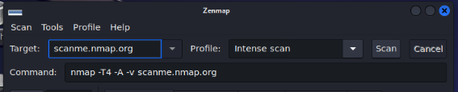

In the Profile dropdown, select the scan type you want (e.g., Intense Scan).

Start the scan and analyze the information displayed in different tabs:

- **Nmap Output:** Displays the raw Nmap command results in text format.
- **Host:** Lists all scanned hosts found during the scan.
- **Ports/Hosts:** Displays all open ports detected for each host (none found in this case).
- **Topology:** Shows a graphical representation of the network and the relationship between scanned hosts.
- **Host Details:** Provides detailed information about the selected host, such as the operating system, open ports, and running services.
- **Scans:** Lists all performed scans for easy tracking.

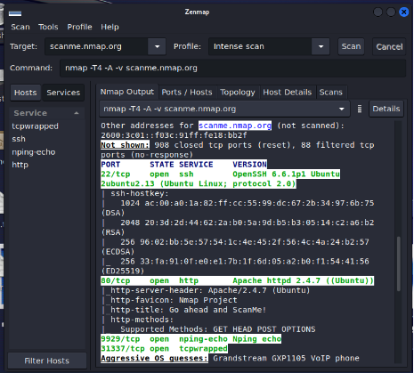

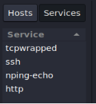

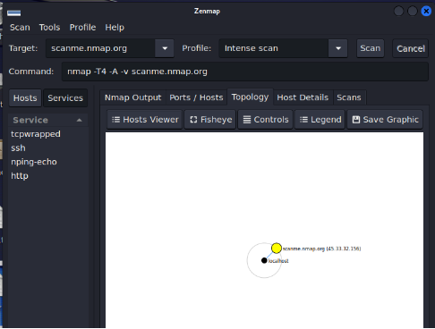

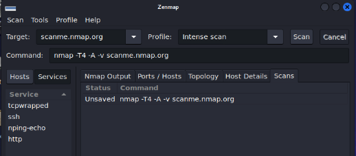

**b.** Scan all open ports on a Windows Server machine with IIS running on port 80

Configure the **Windows Server** machine to listen for web requests on port 80.

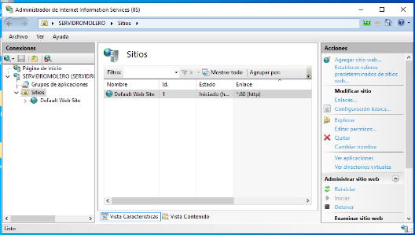

Enter the **IP address** of the Windows Server in Zenmap's **Target** field.

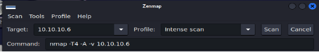

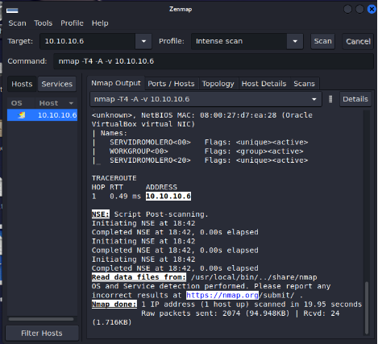

**Ports/Hosts Tab:** Displays a list of open ports on the server, including port 80 as open (highlighted as the first entry)

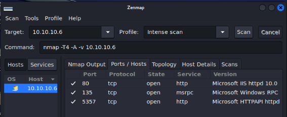

**Topology Tab:** Shows a graphical representation of the network and connections between hosts, similar to the previous task.

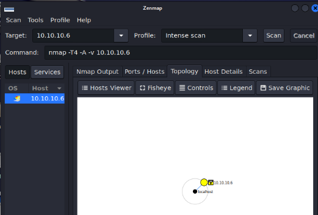

**Host Details Tab:** Provides detailed information about the selected host, including:

- Three detected open ports
- Filtered and scanned ports
- Operating system name

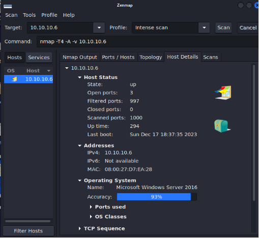

**Scans Tab:** Lists all performed scans, highlighting the IP address of the scanned Windows Server.

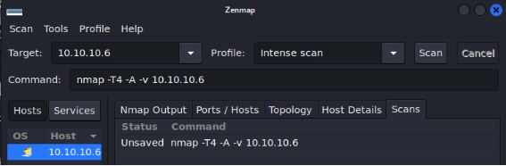

## **Exercise 2: Nmap with NSE Scripts**

**a.** Use Nmap with vulnerability scripts on scanme.nmap.org

Launch Nmap and run the following command using one of its vulnerability scripts like vuln or vulners

·  In this case, we will scan scanme.nmap.org.

·  This scan will identify potential vulnerabilities in the target system.

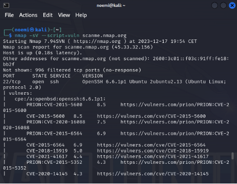

After running the scan, you might see results like the detection of vulnerabilities in the **OpenSSH 6.6.1p1** version. 

**b.** Use Nmap with vulnerability scripts on your Metasploitable 2 machine

Start the **Metasploitable 2** machine and identify its IP address

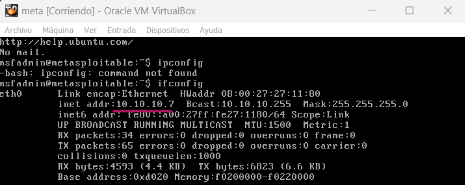

Run the **Nmap** vulnerability scan against the IP of your Metasploitable 2 machine

The scan should display information about open ports and known vulnerabilities present on the Metasploitable 2 machine.

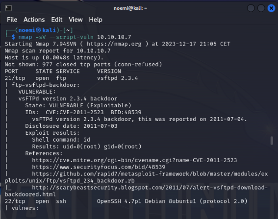

·  Example output might show a variety of vulnerabilities, including open ports such as **21 (FTP)** and **22 (SSH)**.

·  The scan might identify common flaws in Metasploitable, such as outdated services or weak configurations that attackers can exploit.

·  The vulnerabilities displayed could be related to the outdated services and default configurations found on Metasploitable 2, such as old versions of **vsftpd** or **OpenSSH**, which are prone to known exploits.

·  Understanding and exploiting these vulnerabilities is a core part of penetration testing and ethical hacking.

##
## **Exercise 3 – Nmap Script for Brute Force Attack**

**a.** Perform a brute-force SSH attack using Nmap’s ssh-brute script

**Setup**:
To simulate an **SSH brute-force attack** on a Linux machine (Ubuntu Server or Ubuntu Desktop), we will use the **ssh-brute** script provided by **Nmap**.

**Create Dictionaries**:

- First, create two dictionary files:
  - **users.lst**: A file that contains a list of potential usernames (e.g., root, admin, user1).
  - **pass.lst**: A file that contains a list of possible passwords (e.g., password123, admin123, 123456).

**Run the Nmap Command**: 

·  **-p 22**: Specifies that we are targeting port 22, which is typically used for SSH.

·  **--script ssh-brute**: Specifies that we are using the **ssh-brute** script for the attack.

·  **--script-args userdb=users.lst, passdb=pass.lst**: This specifies the dictionaries for usernames and passwords.

·  **ssh-brute.timeout=4s**: Sets the timeout to 4 seconds between each attempt, to avoid triggering account lockouts or blocking measures.

·  **<target\_ip>**: Replace this with the IP address of your target machine.

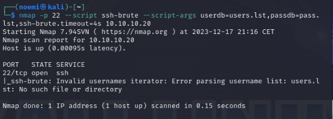

**Results**:

- The **ssh-brute** script will attempt to log in to the target machine by trying all possible combinations of usernames and passwords from the dictionary files.
- If the attack is successful, the Nmap output will show the **successful login credentials** used to authenticate.
- If the attack fails, the script will show that all attempts have failed, indicating the target machine's resistance to brute-force login.

## **Conclusion**

In this activity, we explored advanced scanning tools like **Zenmap** and **Nmap** to perform security assessments on different target systems. By using Zenmap's graphical interface, we successfully identified open ports and analyzed the network topology of various systems. We then delved into vulnerability scanning using Nmap's built-in **NSE scripts**, uncovering potential weaknesses such as outdated OpenSSH versions. In the final exercise, we simulated a brute-force SSH attack with the **ssh-brute** script to test the strength of system passwords. Through these exercises, we gained practical experience in identifying security vulnerabilities and understanding the importance of robust network defenses. These tools provide essential insights into system security and are crucial for ethical hacking practices.
