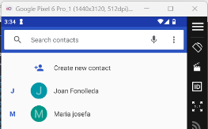

Noemí Molero

**Security in Mobile and IoT Devices**
## **Security in Systems, Networks, and Services**
**Hacking Android phone with msfvenom**

### **Introduction:**
In this practice, we'll explore how to ethically hack an Android device using **Msfvenom** and **Metasploit**. Our goal is to create a malicious APK capable of establishing a **remote Meterpreter session** with the attacker’s Kali Linux machine.

NOEMÍ MOLERO

**INDEX**
#
[Security in Systems, Networks, and Services	1](#_toc189564196)

[Introduction	1](#_toc189564197)

[Exercise 1: **Hack an Android Mobile with Msfvenom**	3](#_toc189564198)

[Conclusion	7](#_toc189564199)

##
##
## **Exercise 1: Hack an Android Mobile with Msfvenom**
##### **a.** Create a malicious APK with Msfvenom
We’ll generate a malicious APK containing a **Meterpreter payload** to establish a remote connection between the Android device and the attacker.

**b.** Set up the Metasploit listener

**c.** Run the malware on your mobile or Android virtual machine

Access the APK from your mobile device or emulator and install it.

- Enable installation from **unknown sources** if necessary.
- Grant the app all permissions requested.

    

#####
#####
##### **d.** Hide the malware icon
This removes the malware icon from the home screen, making it less likely for the victim to notice.

**e.** Send an SMS from Meterpreter

##### **f.** Extract contacts from the device

    

##### **g.** Extract SMS messages

**h.** Download an image from the device

Note: Virtual machines may restrict file access.
##### **i.** List available cameras

**j.** Capture a photo

This may not work on a virtual machine but will function on a real Android device.

##### **k.** Experiment with other Meterpreter commands
View running processes:

Useful for identifying interesting or vulnerable processes.

Open a shell on the device

Execute Android-specific commands.

## **Conclusion:**
This practice provided a powerful insight into how attackers can exploit vulnerabilities in Android devices using tools like **Msfvenom** and **Metasploit**. By creating a malicious APK and establishing a reverse Meterpreter session, we demonstrated the extensive control that can be gained over a compromised device.

From extracting sensitive information such as contacts and SMS to taking remote photos and executing system commands, we saw firsthand how devastating these attacks can be if devices are not adequately protected.

However, the true value of this exercise lies in understanding how to **prevent and defend against such threats**. By recognizing the signs of malware, regularly updating systems, limiting app permissions, and avoiding downloads from untrusted sources, users can significantly enhance their device security.

Ultimately, this practice underscores the need for vigilance in the digital age, empowering us to better protect our mobile devices and data from malicious actors.

