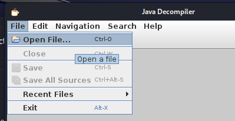

Noemí Molero

#
# **Mobile Application Vulnerability Analysis Report**
## **Security in Systems, Networks, and Services**
**Analyzing Vulnerabilities in Mobile Applications**
###
### **Introduction**
Mobile application vulnerabilities are a critical concern for platforms like Android. Google dedicates significant resources to ensuring that applications on the Play Store are secure. To achieve this, they run a Bug Bounty Hunting program through the Google Play Security Rewards Program, incentivizing users to identify vulnerabilities.

NOEMÍ MOLERO

**INDEX**

[Mobile Application Vulnerability Analysis Report	1](#_toc189566032)

[Security in Systems, Networks, and Services	1](#_toc189566033)

[Introduction	1](#_toc189566034)

[Exercise 1: **OWASP Top 10 Mobile Vulnerabilities**	3](#_toc189566035)

[Exercise 2: **Common Weakness Enumeration (CWE)**	3](#_toc189566036)

[Exercise 3: **Analyzing Vulnerabilities in DIVA App**	4](#_toc189566037)

[Install DIVA on Android Machine (Using ADB)	4](#_toc189566038)

["Insecure Logging" Vulnerability	6](#_toc189566039)

[Hardcoding Issues (Part 1)	7](#_toc189566040)

[Insecure Data Storage (Part 1)	11](#_toc189566041)

[Insecure Data Storage (Part 2)	12](#_toc189566042)

[Insecure Data Storage (Part 3)	13](#_toc189566043)

[Insecure Data Storage (Part 4)	14](#_toc189566044)

[Input Validation Issues (Part 2)	15](#_toc189566045)

[Input Validation Issues (Part 3)	16](#_toc189566046)

#
## **Exercise 1: OWASP Top 10 Mobile Vulnerabilities**

Visit the official OWASP mobile project page [here](https://owasp.org/www-project-mobile-top-10/). Below are brief descriptions of key vulnerabilities:

1. **M3: Insecure Authentication/Authorization:** Occurs when an app improperly verifies user identity or permissions, allowing unauthorized access to sensitive data or restricted functions.
1. **M5: Insecure Communication:** Data transmitted between the app and the server is unprotected, making it susceptible to interception by attackers (e.g., over public Wi-Fi networks).
1. **M9: Insecure Data Storage:** Sensitive data is stored insecurely on the device, posing a risk if the device is lost or stolen.
1. **M10: Insufficient Cryptography:** Weak or poorly implemented cryptographic algorithms leave sensitive data exposed to third parties.
###
## **Exercise 2: Common Weakness Enumeration (CWE)**

Based on the [CWE classification by MITRE](https://cwe.mitre.org/data/definitions/919.html), below are descriptions of common weaknesses:

1. **CWE-319: Cleartext Transmission of Sensitive Information:** Transmitting sensitive information without encryption exposes it to interception.
1. **CWE-798: Use of Hard-coded Credentials:** Hardcoding passwords or keys in the application code makes it easy for attackers to gain unauthorized access.
1. **CWE-921: Storage of Sensitive Data in a Mechanism without Access Control:** Storing critical information without proper access controls increases the risk of unauthorized access.
1. **CWE-312: Cleartext Storage of Sensitive Information:** Sensitive information stored without encryption can be easily accessed in the event of device theft or loss.
1. **CWE-362: Race Condition:** Occurs when multiple processes simultaneously access a shared resource without proper synchronization, leading to potential data manipulation.
###
###
###

#
## **Exercise 3: Analyzing Vulnerabilities in DIVA App**
DIVA (Damn Insecure and Vulnerable App) is an intentionally vulnerable Android app designed to help demonstrate security flaws.

**o** jd-gui → Java Decompiler - Graphics User Interface 

**o** dex2jar → Dalvik EXecutable 2 

### **Install DIVA on Android Machine (Using ADB)**
First, we need to set up the Android device or Android Virtual Device (AVD).

**Steps:**

- Launch our Android Virtual Machine and ensure it is fully booted.
- Find the IP address of the virtual machine (in this example, it’s 10.10.10.50).

**Connect via ADB**

Install the DIVA application (which stands for "Damn Insecure and Vulnerable App") using ADB

If the installation is successful, the DIVA app should now appear on the Android device.

#####
#####
### **"Insecure Logging" Vulnerability**
**Vulnerability Explanation:**
The "Insecure Logging" vulnerability occurs when an application logs sensitive user information to log files without encryption or proper protection. This could include data such as usernames, passwords, or payment card information.

To demonstrate this vulnerability, you will capture sensitive data being logged.

**a.** Set Up Logging on Kali Linux

**b.** Perform a Sensitive Operation on the Victim Android Device

Go back to the Kali Linux shell and review the logs captured by adb logcat. We can find our credentials. 

####
### **Hardcoding Issues (Part 1)**

**Vulnerability Explanation:**
This vulnerability arises when important values, such as secret keys, are hardcoded directly into the application's source code. This allows attackers to easily extract these keys and compromise the security of the application or associated services.

**a.** Observing the Vulnerability
#####

#### **b.** Reverse Engineering the Application with JADX
To investigate the issue, we'll perform reverse engineering to inspect the application code

Move both the APK file and dex2jar tool to the same working directory on your Kali Linux machine.

Convert the APK to a .jar file using the following command

Open the generated .jar file in JADX

**c.** Analyzing the Decompiled Code

Navigate through the files in JADX until you find the relevant class responsible for password validation.

In the code, you can identify the hardcoded password

**d.** Testing the Discovered Password

![ref1]

The application confirms the password as correct, proving that the vulnerability exists

![ref2]

### **Insecure Data Storage (Part 1)**

**Vulnerability Explanation:**

This challenge demonstrates how an application improperly stores sensitive information, which could lead to data leakage and security breaches.

**a.** Accessing the Storage Files

To access the application's storage, first obtain administrator permissions

**b.** Locating Sensitive Data

Search for an XML file where user credentials may be stored.

We can see information such as the username and password that we previously entered in the application, stored in plaintext:

### **Insecure Data Storage (Part 2)**

**Vulnerability Explanation:**

Similar to the previous data storage vulnerability, sensitive user information such as usernames and passwords is improperly stored in a file, making it accessible to attackers. 

Open the file using the cat command

You will see the plaintext credentials, proving the existence of this vulnerability.

#####
#####
### **Insecure Data Storage (Part 3)**

**Vulnerability Explanation:**
Once again, sensitive data inserted into the application form is found stored insecurely in plaintext within the file system.*** 

Navigate through the file system to locate the file storing these details.

Open the file and verify that the user credentials are stored without encryption.

####
####
####
####
####

####
### **Insecure Data Storage (Part 4)**

**Vulnerability Explanation:**

The application attempts to store data on the external SD card but initially fails due to missing storage permissions.

Go to the application settings and enable storage permissions

Re-enter the credentials in the application, which now successfully stores the information.

Locate a file named .uinfo.txt on the SD card.

View the file contents to find the plaintext user credentials:

###
### **Input Validation Issues (Part 2)**
**Vulnerability Explanation:**
The application opens a webpage within its own framework. Due to poor input validation, it allows reading internal system files.

.

Test by accessing an internal file URL through the application.

Locate and read a previously identified XML file storing credentials:

This vulnerability exists because the application does not sanitize or restrict URLs, allowing access to internal and SD card files.

###

### **Input Validation Issues (Part 3)**
**Vulnerability Explanation:**
This challenge demonstrates how the application crashes due to improper input handling, potentially leading to denial-of-service scenarios.

Notice a bug.

Review the logs with adb logcat

 

Logs will indicate an application crash due to unhandled exceptions, such as excess input credits or other unusual system conditions that the application cannot handle.

## **Conclusion**

In this series of exercises, we explored common security weaknesses and vulnerabilities in software development, focusing on several critical areas. We began by examining the **Common Weakness Enumeration (CWE)**, which provided a framework for identifying common security flaws. We then analyzed specific vulnerabilities in the **DIVA app**, including **insecure logging**, **hardcoding issues**, and **insecure data storage**, uncovering how these vulnerabilities could be exploited in real-world applications. We also delved into **input validation issues**, highlighting the importance of securing user inputs to prevent attacks like SQL injection and buffer overflow. Overall, these exercises reinforced the significance of implementing proper security practices throughout the software development lifecycle, from coding to testing.
2

[ref1]: img/MAV/Aspose.Words.9f74e2f6-3617-48f3-983e-22c25845f966.023.png
[ref2]: img/MAV/Aspose.Words.9f74e2f6-3617-48f3-983e-22c25845f966.024.png
