
Noemí Molero

# **Mobile Security in Systems, Networks, and Services**
## **Security in Mobile and IoT** 
**Ngrok**

### **Introduction:**
In this practice, we're stepping up our game by learning how to expose services on Kali Linux to the entire internet using **Ngrok**, a powerful tool that acts as a bridge between your private machine and the outside world. Forget the limitations of local network attacks—now you'll be able to access and interact with your Kali services from anywhere, anytime.

Here’s what we'll cover:

- **Web Server Exposure:** We’ll set up an **Apache web server** and expose it through Ngrok so anyone with the right link can view the website you create.
- **Malware Testing:** We’ll dive into creating **malicious APK files** with Msfvenom, then use Ngrok to manage reverse connections from victim devices, no matter where they are located.
- **Real-World Testing:** By setting up Kali to listen for connections, we’ll demonstrate how to open a remote session using **Meterpreter**, gaining full control of a victim’s device.

# **INDEX**
#
[Mobile Security in Systems, Networks, and Services	1](#_toc189563241)

[Security in Mobile and IoT	1](#_toc189563242)

[Introduction:	1](#_toc189563243)

[Exercise 1: **Ngrok for HTTP Server Creation**	3](#_toc189563244)

[Exercise 2: **Ngrok for Reverse Shell Connections**	4](#_toc189563245)

[Conclusion	6](#_toc189563246)

**

##

## **Exercise 1: Ngrok for HTTP Server Creation**

**a.** Install Ngrok on Kali Linux 

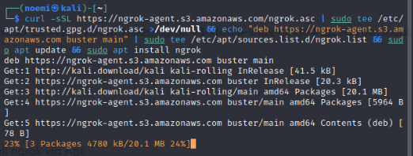

**b.** Configure Ngrok

Obtain your **AuthToken** from the Ngrok dashboard.

**c.** Start Apache on Kali Linux

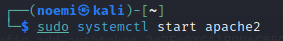

#### **d.** Add an HTML File:
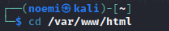

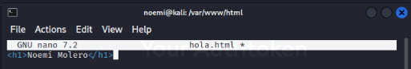

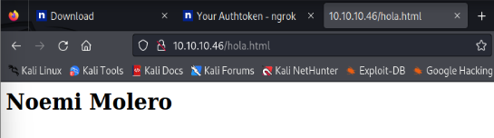

**e.** Expose Port 80 with Ngrok

Ngrok will display a **forwarding WAN address**, such as: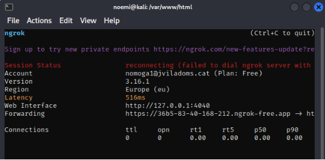

**f.** Test Global Accessibility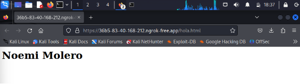

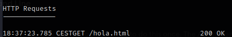

## **Exercise 2: Ngrok for Reverse Shell Connections**

**a.** Expose Port 4444 with Ngrok

Ngrok will provide a **WAN address and port** for forwarding.

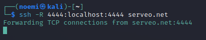

**b.** Create a Malicious APK

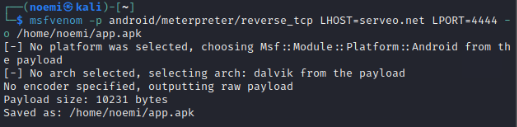

**c.** Start the Listener on Kali Linux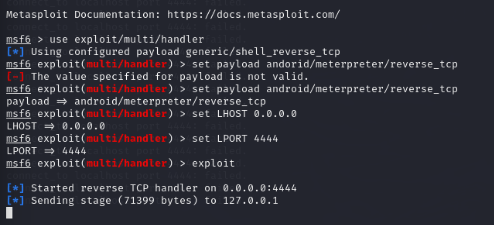

**d.** Test the Malware

·  Share the APK file using a shared folder or other transfer method.

·  Install and open the app on the victim device (Android VM or a real phone).

·  Grant the necessary permissions.

·  Upon execution, the session should open in Metasploit, allowing remote access to the victim's device.

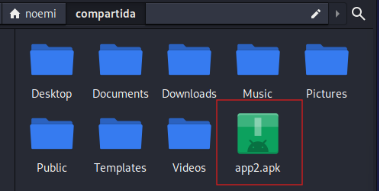

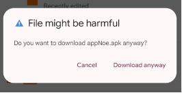	

## **Conclusion:**
These exercises demonstrated how to:

- Expose local services using Ngrok to make them accessible globally.
- Create and deploy a malicious APK for reverse connections using Ngrok and Msfvenom.

Ngrok facilitates public exposure of local ports and services, demonstrating its potential for both legitimate uses and cybersecurity demonstrations.

2

