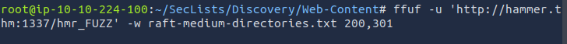
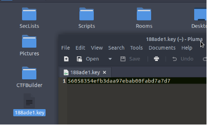

# **Hammer**

[**Web Application Pentesting**](https://tryhackme.com/paths)

**Level**

##

## **Introduction**: 
In this section, we will exploit a vulnerable web application to bypass login protections, brute force a 2FA code, and manipulate JWT tokens to gain unauthorized command execution and access sensitive files.

NOEMÍ MOLERO

**INDEX**
#
[**Hammer**	1](#_toc189738737)

[**Introduction**:	1](#_toc189738738)

[First Step: **Scanning**	3](#_toc189738739)

[Second Step: **Fuffing**	3](#_toc189738740)

[Third Step: **Bypassing 2FA**	4](#_toc189738741)

[**Conclusion**	10](#_toc189738742)

**Challenge**: Login into the dashboard and the content of the file /home/ubuntu/flag.txt

No clues to solve the challenges.

IP: 10.10.14.123

## **First Step: Scanning**
We see **two open ports - 22 and 1337**

We will try what we see on port 1337, If we try a typic login like admin admin, we go to the cookie section we can see a PHPSESSID value =gs2plroeet1vdm5vkpvdnm3674

## **Second Step: Fuffing**
Let’s try the forget my password.

It redirects to reset\_passwd\_php, but we need an email-address.

We can inspect the HTML of the login page to find something, and we got it, a comment with the directory of naming convention, so let’s do brute force. 

**We found 4 directories.**

Let’s see the logs file, **we found an e-mail address.**

## **Third Step: Bypassing 2FA**
We can go back to the reset passwd page and introduce our found email address; we can see that we must enter an OTP.

We can create a dictionary with numbers from 0000 to 9999

Let’s prepare our payload first:

\1) As we saw at the password reset page, we are only given 180 seconds to input the 4 digits recovery code, we need to override this limit because Brute-forcing 10000 digits can take a while to successfully find us the right combination for the 4-digit \. we will be using the command flag with ffuf → X-Forwarded-For This will act as a Rate-Limit ByPass

\2) We will be needing the cookie ( PHPSSESID ) that we found earlier, but the new one, we should go another time to the “forgot your passwd” section and take the new PHPSESSID, and enter it to our command, in less than 120 sec:

- **-w codes.txt:** Specifies the wordlist (codes.txt) that will be used for fuzzing. This wordlist contains the payloads that will replace the FUZZ keyword in the command.
- **-u "http://hammer.thm:1337/reset\_password.php":** The URL of the target web application. This is where the fuzzing request will be sent.
- -**X "POST":** Specifies the HTTP method to be used, which in this case is POST.
- **-d "recovery\_code=FUZZ&s=60":** The data being sent in the body of the POST request. The FUZZ keyword here will be replaced with each entry from codes.txt during the fuzzing process. It appears that the fuzzing is targeting the recovery\_code parameter.
- **-H "Cookie: PHPSESSID=datlnccflgrmhqc9d5pkb6b8a7":** Adds a custom header to the request, specifically a Cookie header with a session ID. This is likely needed to maintain a session with the web application.
- **-H "X-Forwarded-For: FUZZ":** Adds another custom header, X-Forwarded-For, which is often used to identify the originating IP address of a client connecting to a web server. In this case, it's being fuzzed to see if the application behaves differently based on the IP address.
- **-H "Content-Type: application/x-www-form-urlencoded":** Specifies the content type of the data being sent. This is typical for form submissions.
- **-fr "Invalid":** Filters out responses that contain the string "Invalid". This helps in identifying successful or interesting responses that differ from the common invalid ones.
- **-s:** Runs ffuf in silent mode, which reduces the amount of output to only essential information.

If we enter the 4163 code into the 2FA, we can see a Reset Passwd page

After we changed the passwd to 1234, it redirects us to the login page, so we will try to enter with the email we found and the new passwd 1234, **we’re in, and we have the first flag**:

To get the second flag, we should find the content of the file **/home/ubuntu/flag.txt**

Let’s start by entering commands on the search bar of the user. 

We find a 188ade1.key 

Looking into the source code is always a good idea early on. When we do that, we see the following script.

This script is clearly related to the commands we put through the dashboard; we can even see the Error executing command error message on line 83. This error appears when we put in any commands that are not ls.

We can also see a jwtToken, something I had never heard of, on line 68 (more on this later) and then the creation of an Authorization header using the afore mentioned jwtToken on line 77.

So, from looking at this, we can see this is likely related to how the server decided if we can execute a command or not. If we can mess with this, perhaps we can execute commands (like cat etc/shadow) and get something useful?

We can try to decode the jwtToken

We can see some interesting items in the payload, the role and user\_id, which we might be able to manipulate to allow for greater access as this token is used with the authorization header in Fig 13.

The decoded section of this jwtToken can be modified, meaning we could change the role to admin, however, the tokens need to be signed by the the user’s (admin) key to validate it, if we use the wrong key then the server will not accept the token and won’t authorize the command we send through.

Steps:

56058354efb3daa97ebab00fabd7a7d7

We modify it and copy to the clipboard.

Then we open burpsuite and modify the request with the new jwtToken and we will get the flag in the response!

We get the flag on the response

Done it!

## **Conclusion**
We successfully gained access to the dashboard by brute-forcing the 2FA code and resetting the password. With creative analysis of the source code, we discovered a JWT-based authorization mechanism that allowed us to escalate privileges by forging a valid token signed with the correct key. This enabled us to execute arbitrary commands and retrieve the final flag. Through a combination of enumeration, brute forcing, and token manipulation, we demonstrated effective techniques for solving complex web-based security challenges.

